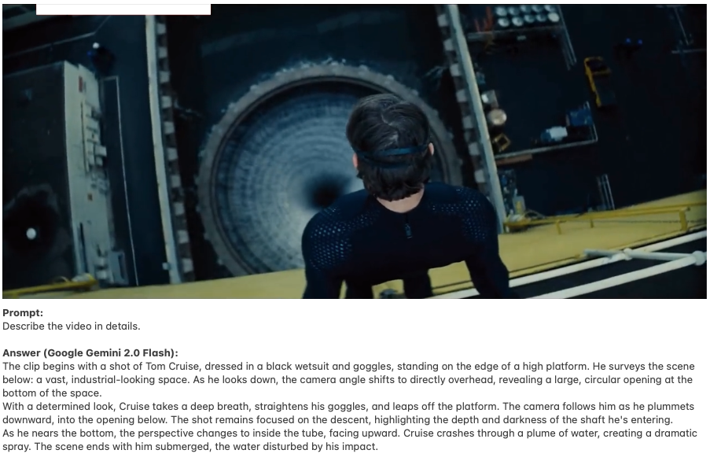

# Video Database based on Video-Understanding Models

This project implements a video retrieval system that connects natural language queries with untrimmed video corpora. It leverages advanced video understanding models (e.g., Google Gemini 2.0 Flash) and vector-based semantic search to retrieve semantically relevant clips without manual annotation.

  

### Features

- Natural language search over video content
- Automatic captioning using Google Gemini 2.0
- Vector indexing using FAISS for fast retrieval
- Evaluation on the MovieChat-1K dataset

### Query Pipeline

1. **Segmentation**: Split source videos into 15-second clips
2. **Captioning**: Generate detailed captions using Gemini via Vertex AI
3. **Embedding**: Encode captions with SentenceTransformers (`all-MiniLM-L6-v2`)
4. **Indexing**: Store vectors in a FAISS index with metadata in a sidecar file
5. **Querying**: Embed user queries and perform top-K similarity search

### Evaluation

The system was tested on open-ended queries with the MovieChat-1K dataset and showed strong semantic alignment:
- Recall@5 = 100% for two out of three queries
- Smooth embedding score decay with clear separation between relevant and irrelevant results

### Technology Stack

- Python 3.11
- Google Vertex AI (Gemini API)
- SentenceTransformers + PyTorch
- FAISS (CPU)
- moviepy, tqdm, pickle

### Future Work

- Adaptive clip segmentation and frame sampling
- Explicit modeling of spatial and temporal constraints
- Broader benchmark evaluations and user studies

